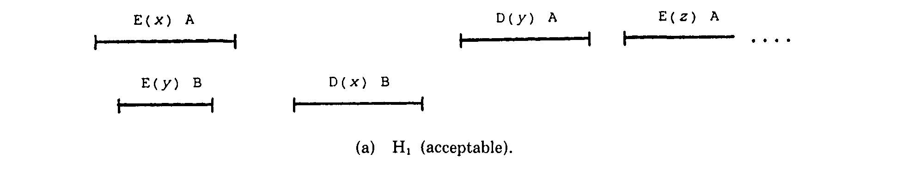
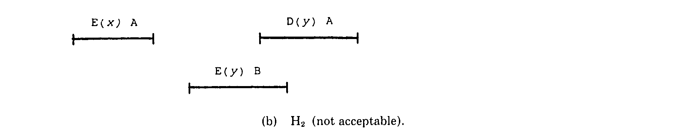
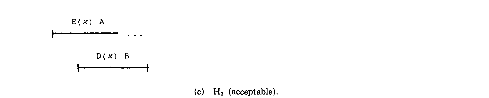
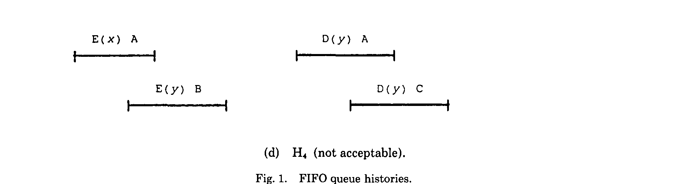

% I can linearizable and you can too! 
% What linearizable consistency is, why it's good and why it's bad, and why you might care
% Ceri Storey

# Single computer makes life easier

## Need more than one

* Computers usually break
* Need more than one

## Various and many models

* Weaker models often provide better peformance, but are more difficult to reason about.
* Spider Diagram from Consistency in Non-Transactional Distributed Storage Systems

# Linearizability

## Basically

* Pretend we only have one computer 
* Single thread of control
* _So_ much easier to reason about

## Definition

* Defined in [Linearizability: a correctness condition for concurrent objects](http://doi.acm.org/10.1145/78969.78972)
* Provides atomicity, consistent wall-clock ordering
* Defined In terms of an application state machine (eg: a queue, stack, &c)
* Can be checked automatically

## ...

* Each call takes a finite amount of time
* Effect can happen atomically within that window
* Allows for _some_ reordering.
* Locality; system is correct iff each individual object is correct

## Queue Example 1

## Queue Example 2

## Queue Example 3

## Queue Example 4

# See also:

* [Linearizability: a correctness condition for concurrent objects](https://dl.acm.org/citation.cfm?id=78972)
* [Linearizability versus Serializability](http://www.bailis.org/blog/linearizability-versus-serializability/)
* [Serializability, linearizability, and locality](https://aphyr.com/posts/333-serializability-linearizability-and-locality)
* [Testing for Linearizability](https://www.cs.ox.ac.uk/people/gavin.lowe/LinearizabiltyTesting/paper.pdf)
* [Can’t we all just agree?](https://blog.acolyer.org/2015/03/01/cant-we-all-just-agree/)
* [Consistency in Non-Transactional Distributed Storage Systems](https://arxiv.org/abs/1512.00168)
